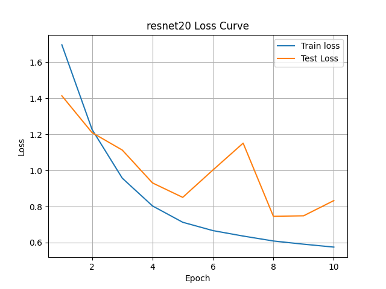
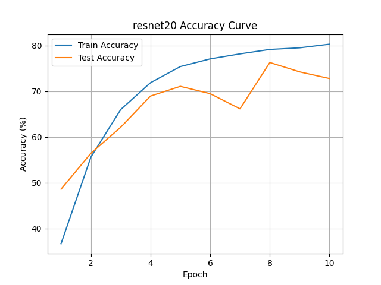
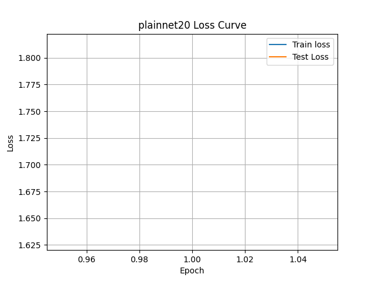
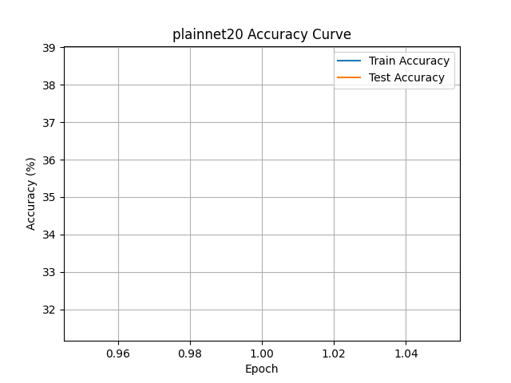
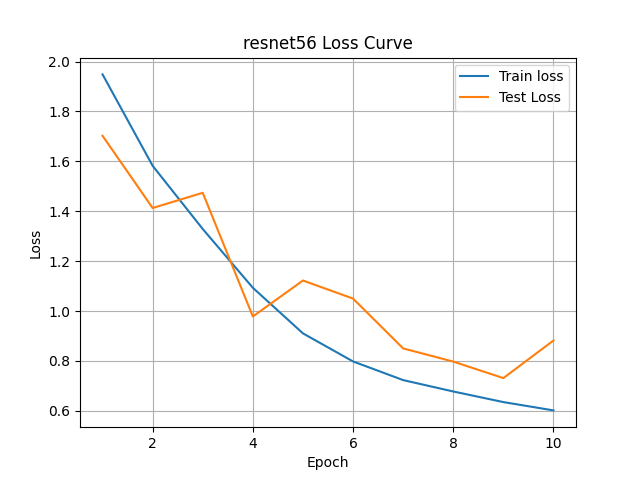
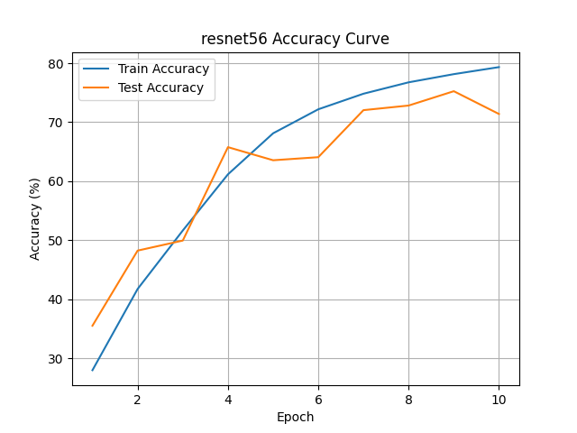
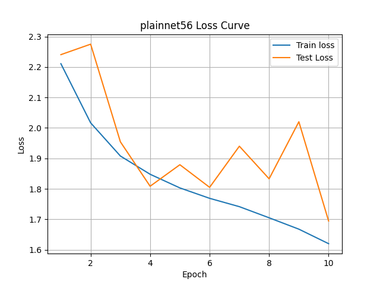
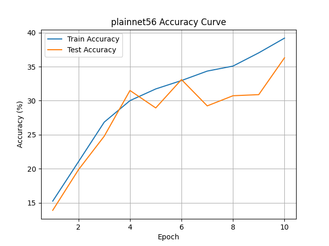

# ResNet Paper Implementation

PyTorch implementation and reproduction project of the ResNet paper on CIFAR-10.

This repository is based on the paper:

**Deep Residual Learning for Image Recognition**  
Kaiming He, Xiangyu Zhang, Shaoqing Ren, Jian Sun  
Paper: https://arxiv.org/abs/1512.03385

## Project Goal

The goal of this project is to understand and reproduce the core idea of ResNet through CIFAR-10 experiments.

This project focuses on comparing:

- PlainNet: CNN without shortcut connections
- ResNet: CNN with residual shortcut connections

The main idea is to observe how residual connections help deeper neural networks train more effectively.

## Implemented Models

Currently implemented:

- PlainNet-20
- PlainNet-56
- ResNet-20
- ResNet-56

## Core Concept

A normal CNN block learns a direct mapping:

```text
H(x)
```

ResNet instead learns a residual function:

```text
F(x) = H(x) - x
```

So the final block output becomes:

```text
F(x) + x
```

This shortcut connection helps deeper networks train more stably.

## Project Structure

```text
resnet-paper-implementation/
│
├── models/
│   ├── resnet.py
│   └── plainnet.py
│
├── notes/
│   └── paper_summary.md
│
├── results/
│   ├── resnet20_history.csv
│   ├── resnet20_loss_curve.png
│   ├── resnet20_accuracy_curve.png
│   ├── plainnet20_history.csv
│   ├── plainnet20_loss_curve.png
│   ├── plainnet20_accuracy_curve.png
│   ├── resnet56_history.csv
│   ├── resnet56_loss_curve.png
│   ├── resnet56_accuracy_curve.png
│   ├── plainnet56_history.csv
│   ├── plainnet56_loss_curve.png
│   └── plainnet56_accuracy_curve.png
│
├── train.py
├── plot_results.py
├── test.py
├── utils.py
├── README.md
└── .gitignore
```

## Training Pipeline

The training pipeline includes:

- CIFAR-10 dataset loading
- Data augmentation
  - RandomCrop
  - RandomHorizontalFlip
- Normalization
- Model selection
- CrossEntropyLoss
- SGD optimizer
- Training and evaluation loop
- Best checkpoint saving
- CSV history saving
- Loss and accuracy curve plotting


## Current Experiment Results

The current results are from a **10 epoch experiment** on CIFAR-10.

This is a simplified reproduction experiment to compare PlainNet and ResNet models under the same training setting.

| Model | Epochs | Train Loss | Train Acc | Test Loss | Test Acc |
|---|---:|---:|---:|---:|---:|
| ResNet-20 | 10 | 0.5752 | 80.31% | 0.8328 | 72.79% |
| PlainNet-20 | 10 | 0.7482 | 74.22% | 0.8646 | 71.66% |
| ResNet-56 | 10 | 0.6017 | 79.33% | 0.8820 | 71.39% |
| PlainNet-56 | 10 | 1.6200 | 39.18% | 1.6944 | 36.30% |

In the 10 epoch experiment, ResNet-20 achieved higher test accuracy than PlainNet-20 under the same training setting.

More importantly, PlainNet-56 showed a significant performance drop compared to PlainNet-20, while ResNet-56 maintained much better performance than PlainNet-56. This result is consistent with the degradation problem discussed in the ResNet paper and suggests that shortcut connections help deeper CNN models train more effectively.

However, this is still a simplified experiment with a short training schedule. Longer training and more detailed analysis will be conducted in future work.

## Result Curves

The following curves show the 10 epoch training results for ResNet-20, PlainNet-20, ResNet-56, and PlainNet-56.

### ResNet-20 Loss Curve



### ResNet-20 Accuracy Curve



### PlainNet-20 Loss Curve



### PlainNet-20 Accuracy Curve



### ResNet-56 Loss Curve



### ResNet-56 Accuracy Curve



### PlainNet-56 Loss Curve



### PlainNet-56 Accuracy Curve



## How to Run

Train a model:

```bash
python train.py
```

The model can be changed in `train.py`:

```python
model_name = "resnet20"
```

Available options:

```text
resnet20
resnet56
plainnet20
plainnet56
```

Plot training results:

```bash
python plot_results.py
```

The target model for plotting can be changed in `plot_results.py`:

```python
model_name = "resnet20"
```

## Current Status

Completed:

- CIFAR-10 ResNet model implementation
- CIFAR-10 PlainNet model implementation
- Training pipeline
- CSV result saving
- Loss and accuracy plot generation
- ResNet-20 10 epoch experiment
- PlainNet-20 10 epoch experiment
- ResNet-56 10 epoch experiment
- PlainNet-56 10 epoch experiment
- Basic comparison between PlainNet and ResNet models

Next steps:

- Extend experiments to PlainNet-56 and ResNet-56
- Train models for more epochs
- Add detailed analysis of training and test curves
- Compare results with the original ResNet paper

## Notes

Model checkpoints and datasets are not uploaded to this repository.

Ignored files include:

- `data/`
- `checkpoints/`
- `*.pth`
- `*.pt`
- Python cache files